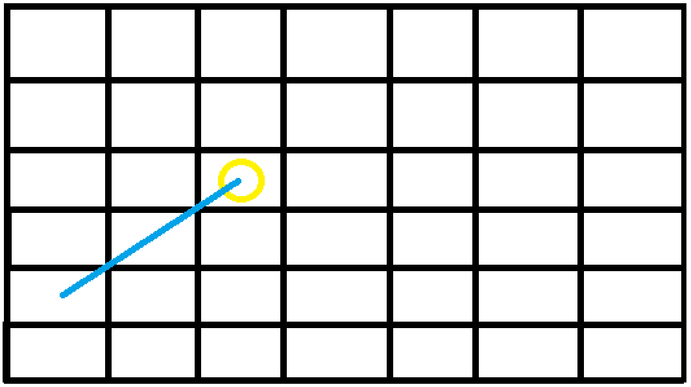
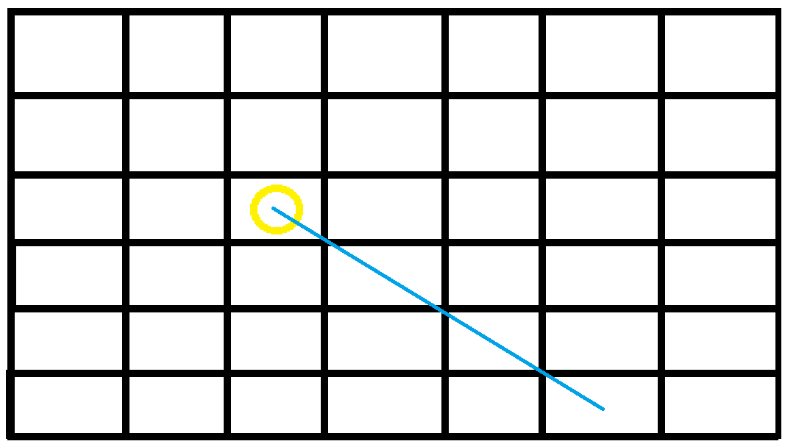

# Práctica 5 - Objetos, clases e interfaces

[](https://coveralls.io/github/ULL-ESIT-INF-DSI-2122/ull-esit-inf-dsi-21-22-prct05-objects-classes-interfaces-Yeixon98?branch=main)

Indice

1. [Objetivos](#Object)
2. [Herramientas](#Tools)
   * [Typedoc](#TypeDoc)
   * [Mocha y Chai](#Test)
   * [Instanbul y Coveralls](#Quality)
3. [Ejercicios](#Exercise)

***

## 1 Objetivos <a name="Object"></a>

El objetivo de esta practica es familiarizarse con los objetos, clases e interfaces que usa TypeScript, todo esto a través de la realización de ejercicios propuestos por el profesor.

***

## 2 Herramientas <a name="Tools"></a>

En esta practica se nos pedia usar herramientas como TypeDoc, Mocha, Chai y opcionalmente Instanbul y Coveralls.

### 2.1 TypeDoc <a name="TypeDoc"></a>

TypeDoc es una herramienta que nos permitirá documentar nuestro código a través de comentarios escrito en el mismo, esta herramienta genera una página web con toda esta información.

Para llevar a cabo la instalación de la misma, seguimos los pasos que vemos en este [video](https://drive.google.com/file/d/19LLLCuWg7u0TjjKz9q8ZhOXgbrKtPUme/view) hecho por el profesor.

### 2.2 Mocha y Chai <a name="Test"></a>

Mocha y Chai son unos framework que nos permiten realizar test a nuestro código escrito en TypeScript.

Para llevar a cabo la instalación de ambos, seguimos los pasos que vemos en este [video](https://drive.google.com/file/d/1-z1oNOZP70WBDyhaaUijjHvFtqd6eAmJ/view) hecho por el profesor.

### 2.3 Instanbul y Coveralls<a name="Quality"></a>

Instanbul y Coveralls son dos herramientas que nos permiten saber que cantidad de codigo se esta ejecutando, segun los test realizados, a traves de unos informes que se generan con Instanbul y son enviados a [Coveralls](https://coveralls.io/) generando asi un informe.

Para llevar a cabo la instalación de ambos, seguimos los pasos que vemos en este [video](https://drive.google.com/file/d/1xLDc4CpoYpsAlCFO_4DMwu7MKCtcZDnh/view) hecho por el profesor.

***

## 3 Ejercicios <a name="Exercise"></a>

### 3.1 - Pokedex

Para este ejercicio se nos pedia simular un combate de pokemons, para ello teniamos que crear la clase Pokemon, con sus atributos, los cuales eran indicados en el guion de la practica.

```ts
class Pokemon {
  constructor(public name: string, public weight: number, public height: number, public type: string, public atk: number, public def: number, public spd: number, public hp: number) {
  }
}
```

Seguido de esto nos pedian hacer una clase Combate, que nos permitiara simular el combate entre los dos pokemons, esta clase recibe como parametro para construirse, dos pokemons.

```ts
class Combate {
  constructor(public pkm1: Pokemon, public pkm2: Pokemon) {
  }
  ...
}
```

Una vez tenemos los dos Pokemons a combatir, necesitamos saber la eficacia de los ataques entre ellos, para esto usamos la una funcion desarrollada en la Practica 3, el Ejercicio 8.

```ts
efficiency(typeA: string, typeD: string, daño: number): number {...}
```

Esta funcion recibe el tipo del pokemon que ataca, el tipo del pokemon que defiende, y el daño base que tendria ese pokemon.

El daño base parte de una formula propuesta en la Practica 3.
```ts
(50 * (pkm1.atk / pkm2.def))
```

Y con todo esto, la funcion `efficiency()` a travez de sentencias `if` determina si el daño es 'x0.5', 'x1', 'x2', dependiendo esto de los tipos que sean los pokemons.

Y por ultimo la funcion `start()` que es la que se encarga de llevar a cabo el simulacro de combate, que mediante de bucles `while` comprueba si alguno de los pokemons a muerto y en caso que no continua. Dentro de estos bucles se van mostrando que pokemon ataca y cual defiende y la vida del defensor.

```ts
//Podemos ver como calculamos el daño total que puede realizar cada pokemon
let daño1: number = this.efficiency(this.pkm1.type, this.pkm2.type, (50 * (this.pkm1.atk / this.pkm2.def)));

let daño2: number = this.efficiency(this.pkm2.type, this.pkm1.type, (50 * (this.pkm2.atk / this.pkm1.def)));

// Bucle que no para hasta que algun pokemon haya muerto
while (this.pkm1.hp > 0 && this.pkm2.hp > 0) {
  // El Pokemon 1 ataca al Pokemon 2
  console.log(this.pkm1.name + " ataca a " + this.pkm2.name);
  // Quitamos de la vida del pokemon 2 el daño que le hace el pokemon 1
  this.pkm2.hp -= daño1;
  // Comprobamos que el pokemon 2 siga vivio, si no, gano el pokemon 1
  if (this.pkm2.hp > 0)
    console.log(this.pkm2.name + " tiene " + this.pkm2.hp + " de vida.");
  else {
    console.log(this.pkm2.name + " se devilito.")
    console.log("El ganador es: " + this.pkm1.name);

    return "El ganador es: " + this.pkm1.name
  }
  // El Pokemon 2 ataca al Pokemon 1
  ...
}
```

[Codigo](https://github.com/ULL-ESIT-INF-DSI-2122/ull-esit-inf-dsi-21-22-prct05-objects-classes-interfaces-Yeixon98/tree/main/src/ejercicio-01)

[Test](https://github.com/ULL-ESIT-INF-DSI-2122/ull-esit-inf-dsi-21-22-prct05-objects-classes-interfaces-Yeixon98/blob/main/tests/ejercicio-01.spec.ts)

### 3.2 - Conecta 4

Para este ejercicio teniamos que desarrollar el juego [Conecta 4](https://es.wikipedia.org/wiki/Conecta_4), siguiendo todas las reglas del juego, las cuales se mencionan en el guion de la practica.

Para llevar acabo este ejercicio se creo una clase Tablero, que representaria el tablero del juego, esta clase consta con un vector de vectores de tipo Ficha, Ficha es un enumerado ue se creo para poder representar las fichas del juego dentro del tablero. En un estado inicial el tablero esta lleno de fichas vacias.

```ts
enum Ficha { Vacia, Roja, Amarilla }
```
```ts
class Tablero {
  mapa: Ficha[][] = [[], [], [], [], [], [], []]
  constructor() {
    this.mapa.forEach((element: Ficha[]) => {
      for (let i: number = 0; i < 6; i++) {
        element.push(Ficha.Vacia)
      }
    })
  }
  ...
}
```

A continuacion se creo una funcion que nos permitiera insertar una ficha en una columna, algo a mencionar es que el usuario elige la columna, pero la fila es la más abajo posible, por esto, no se pide una fila.

```ts
insertInColumn(col: number, ficha: Ficha): boolean {
  // Comprobamos que la columna sea valida
  if (col < 0 || col > 6) return false
  //Recorremos esa columna buscando la proxima posicion que este con ficha vacia y cambiamos por la ficha que se pasa.
  for (let i: number = 0; i < 6; i++) {
    if (this.mapa[col][i] === Ficha.Vacia) {
      this.mapa[col][i] = ficha
      return true
    }
  }
  return false
}
```

Esta funcion recibe la columna en la cual se quiere insertar la ficha y la ficha que se quiere insertar, y devuelve true o false si se puedo o no insertar.

Una vez tenemos la forma de insertar fichas en el tablero, lo siguiente es saber si el jugador cuando inserta la ficha en el tablero, ha ganado.

Para esto se a desarrollado una funcion muy extensa, ya que es necesario comprobar si conecto 4 en vertical, horizontal, diagonal que sube de derecha a izquierda (/) y la otra diagonal (\\).

Antes de explicar toda esta funcion, primero decir que calculamos la fila de la ficha introducida, ya que la usaremos mas adelante.

```ts
checkWin(col: number, ficha: Ficha): boolean {
  let row: number = 0
  for (let i: number = 6; i >= 0; i--) {
    if (this.mapa[col][i] === ficha) {
      row = i
      break
    }
  }
  ...
}
```

Ademas de esto queiro añadir que hay un fragmento de codigo, que es el que nos permite saber si hay 4 conectadas.

```ts
if (encontrado) {
  if (this.mapa[*][*] === ficha) {
    total++;
  }
  else {
    encontrado = false;
    total = 0;
  }
}

if (this.mapa[*][*] === ficha && !encontrado) {
  encontrado = true;
  total++;
}

if (total == 4) {
  return true;
}
```

Este fragmento del codigo, se usa en cada analisis de direccion, lo que hace es dependiendo del `for` o `do while` en el que este, comprueba si encuentra una ficha y suma 1 ademas marca un flag a true, para si la siguiente es igual incrementar, sino, reiniciar el contador; en caso de que el contador llegue a 4 termina retornando un true, que significa que gano el jugador que acababa de jugar.

A continuacion explicaremos la direccion vertical, para esto simplemente tomamos la columna que se inserto la ficha, que acaba de jugarse, y vamos a recorrer todas las filas hacia arriba de esa columna buscando si hay 4 juntas de este tipo.

```ts
for (let i: number = 0; i < 6; i++) {
  // Dentro esta el segmento que busca 4
  // this.mapa[col][i]
  ...
}
```

Seguimos con la horizontal, para este, es uno de los que usamos la fila, en este caso, lo que hacemos es tomar la fila e ir recorriendo las columnas.

```ts
for (let i: number = 0; i < 7; i++) {
  // Dentro esta el segmento que busca 4
  // this.mapa[i][row]
  ...
}
```

Ahora pasamos a lo realmente complejo, las diagonales, empezaremos con la diagonal (/)

Para no estar modificando los valores originales de la fila y columna de la ficha, realizamos una copia a `nuevaColumna` y `nuevaFila`.

Ahora lo que haremos es buscar la raiz de esta diagonal, osea vamos disminuyendo tanto fila como columna hasta que una de las dos sea 0.

Intentare ilustrarlo con el Paint.


Suponinendo que la ficha se inserto en esta posicion, su raiz seria la indicada por el color azul.

```ts
...
while (nuevaFila != 0 && nuevaColumna != 0) {
  nuevaFila--;
  nuevaColumna--;

  if (nuevaFila == 0 || nuevaColumna == 0)
    break;
}
...
```

Una vez tenemos la raiz, solo queda ir buscando desde la raiz hacia arriba incrementando tanto fila como columna.

```ts
do {
  //Para evitar que se vaya de rango.
  if (nuevaFila >= 6 || nuevaColumna >= 7)
    break;

  // Dentro esta el segmento que busca 4
  // this.mapa[nuevaColumna][nuevaFila]

  nuevaFila++;
  nuevaColumna++;

} while (nuevaFila < 6);
```

Con la otra diagonal (\\) es lo mismo.


Buscamos su raiz disminuyendo fila e incrementando columnas.

```ts
...
while (nuevaFila != 0 && nuevaColumna != 0) {
  nuevaFila--;
  nuevaColumna++;

  if (nuevaFila == 0 || nuevaColumna == 0)
    break;
}
...
```

Una vez tenemos la raiz, solo queda ir buscando desde la raiz hacia arriba incrementando fila y disminuyendo columna.

```ts
do {

  if (nuevaFila >= 6 || nuevaColumna < 0)
    break;

  // Dentro esta el segmento que busca 4
  // this.mapa[nuevaColumna][nuevaFila]

  nuevaFila++;
  nuevaColumna--;

} while (nuevaFila < 6);
```

Despues de finalizar la funcion `checkWin()`, tenemos otra funcion muy simple que es al que nos permite imprimir el tablero, `print()`.
Esta funcion imprime las columnas al reves, de tal forma que da la sensacion que las fichas estan en la parte abajo, cuando realmente estan en la prate superior del vector.

Y por ultimo la funcion `start()` que es la que da comienzo al juego, esta funcion se encarga de gestionar todas las iteracciones.

Para pedir al jugador la columna que desea introducir su ficha, nos ayudamos de un paquete llamado `scanf`, para instalarlo es simple como: 

```
npm i scanf
```
Este paquete nos permite pedir por consola un valor, para ello tenemos que crear una variable para usarlo.
```ts
let scanf = require('scanf')
```

En el juego cada jugador consta de 21 ficha de su color. para limitar el juego a 21 para cada jugador se hizo un `while`, que no para hasta tener 21 iteraciones o que algun jugador haya ganado. 

Como otra regla del juego que aparece en el guion, es que cuando un jugador no pueda insertar una ficha en la columna elegida, se le debe preguntar por otra columna, por esto se usa un `while`, que mientras la funcion `insertInColumn()` sea false, se segira repitiendo.

Una vez la ficha haya sido insertada correctamente se comprueba con `checkWin()` si el jugador a ganado.

```ts
let iterator: number = 0
while (iterator <= 21) { // Numero maximo de fichas que tiene cada jugador
  console.log(" - Player 1 -");
  this.print() // Imprimimos el tablero
  // Pedir Columna a jugar
  // Funcion par añadir la columna

  let option: number = -1
  while (!this.insertInColumn(option, Ficha.Roja)) {
    //Pedir la 'option' columna
    console.log("Seleccione una columna: ");
    let valor: number = scanf('%d')
    option = valor - 1
  }

  if (this.checkWin(option, Ficha.Roja)) {
    console.clear();
    console.log(" Win Player 1");
    this.print() // Imprimimos el tablero
    break
  }
  console.clear();
...
}
```

Opinion personal: Fue muy divertido y comedero de coco llevar acabo este ejercicio. :)


[Codigo](https://github.com/ULL-ESIT-INF-DSI-2122/ull-esit-inf-dsi-21-22-prct05-objects-classes-interfaces-Yeixon98/blob/main/src/ejercicio-02/tablero.ts)

[Test](https://github.com/ULL-ESIT-INF-DSI-2122/ull-esit-inf-dsi-21-22-prct05-objects-classes-interfaces-Yeixon98/blob/main/tests/ejercicio-02.spec.ts)